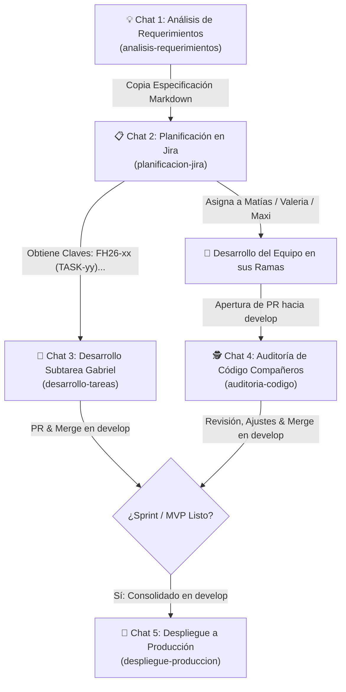

# 🧭 Playbook de Sesiones Aisladas & Catálogo de Prompts (FormosaHack — CiberGuardián)

> **Paradigma Operativo de Gabriel (Team Lead & QA Architect)**: **1 Chat = 1 Tarea / Propósito Específico**.  
> El aislamiento de sesiones previene la degradación del razonamiento (*context poisoning*), elimina la latencia acumulada y garantiza que cada intervención del agente cuente con la máxima agudeza técnica, rigor arquitectónico y estricto apego a las directivas de seguridad.

---

## 🗺️ Mapa de Flujo y Protocolo de Transición (*Handoff*)

El ciclo de ingeniería de Gabriel opera como una tubería modular donde el producto de una sesión alimenta de forma limpia a la siguiente:



### 🧬 Reglas de Oro de Higiene de Contexto y Sincronización

1. **Sesión de Propósito Único**: NUNCA desarrolles dos tareas dentro del mismo chat ni mezcles una auditoría de un compañero con desarrollo propio.
2. **Cierre Inmediato**: En cuanto el agente confirme la fusión del PR en `develop` y la eliminación de la rama de trabajo, **archiva o cierra el chat**. Su ciclo de vida ha terminado.
3. **Sincronización Multi-Dispositivo**: La carpeta `.agents/` se versiona y sube a Git en `develop` para que tus skills y reglas estén 100% sincronizados entre tu PC de escritorio y tu notebook. (Las credenciales sensibles en `.env.jira` permanecen siempre ignoradas por `.gitignore`).
4. **Reinicio Limpio ante Fricción**: Si una sesión acumula demasiados errores o se desvía, verifica el estado en Git (`git status`), abre un **Chat Nuevo**, usa la plantilla correspondiente e indica en el bloque de notas el punto exacto donde se encuentra la tarea.

---

## ⚡ Invocación Ultrarrápida con Slash Commands (Soporte Híbrido)

En Antigravity, cada metodología cuenta con un Slash Command nativo con autocompletado en el chat. Puedes usarlos en dos modalidades:

1. **Modo Inline (Power User - Una sola línea)**: Escribes el comando con los parámetros y el agente arranca directamente sin preguntas intermedias.
2. **Modo Asistido / Formulario (Si escribes solo el comando)**: El agente activa de inmediato un formulario modal interactivo en pantalla (`ask_question`) con botones y selectores, además de darte la plantilla de texto copiable.

| Metodología | Slash Command (y alias) | Ejemplo Inline Rápido | Comportamiento si se invoca solo |
| :--- | :--- | :--- | :--- |
| **🚀 Desarrollo Tarea** | `/desarrollo-tarea` o `/desarrollo-tareas` | `/desarrollo-tarea FH26-39` | Modal interactivo: Clave de Jira + Notas opcionales. |
| **🕵️ Auditoría Código** | `/auditoria` o `/auditoria-codigo` | `/auditoria FH26-40 Matias` | Modal interactivo: Clave + Autor (campo libre) + Rama. |
| **📋 Planificación Jira** | `/planificacion` o `/planificacion-jira` | `/planificacion [pegar requerimiento]` | Solicita la especificación técnica y datos de Épica/Sprint. |
| **🚀 Despliegue Producción** | `/deploy` o `/despliegue-produccion` | `/deploy v1.0.0` | Solicita versión y activa checklist pre-deploy interactivo. |
| **💡 Análisis Requerimientos** | `/analisis` o `/analisis-requerimientos` | `/analisis [pegar idea o requerimiento]` | Despliega formulario de captura de idea y rol objetivo. |
| **🛠️ Edición Metodologías** | `/metodologias` o `/edicion-metodologias` | `/edicion-metodologias desarrollo-tareas` | Solicita motivo de fricción y comportamiento deseado. |

---

## 📇 Catálogo de Prompts y Plantillas por Metodología

---

### 1. 💡 Análisis y Maduración de Requerimientos

* **Skill**: `analisis-requerimientos` | **Regla**: `6_analisis_requerimientos.md`
* **Rol del Agente**: Technical Product Owner & Security Architect.
* **Comportamiento**: Investiga la base de datos viva (PostgreSQL 16), revisa modelos SQLAlchemy, endpoints de FastAPI, schemas de Pydantic v2 y la guía del hackatón. Hace 2 a 4 preguntas clave y genera la especificación estructurada en Markdown lista para Jira. **Prohibido tocar código, Git o Jira API**.
* **Cuándo abrir este chat**: Cuando surja una nueva funcionalidad o ajuste de alcance en CiberGuardián.

#### 📋 Plantilla Copiable
```markdown
Modo Análisis de Requerimientos

Quiero analizar y madurar una nueva funcionalidad para CiberGuardián antes de planificarla en Jira.

- **Idea o Requerimiento en Bruto**: 
  [Describe la idea, problema que resuelve o pega la transcripción del requerimiento aquí]

- **Usuario / Rol Objetivo**: [Ej. Ciudadano en Pánico / Adulto Mayor / Oficial de Seguridad 2FA]

- **Detalles o Restricciones Iniciales**: [Ej. Respuesta en <100ms, integración con API Gateway, persistencia con Soft Delete]

Por favor inspecciona los modelos y endpoints existentes, formúlame las preguntas clave de arquitectura y genera la especificación final en el formato oficial listo para Jira.
```

---

### 2. 📋 Planificación y Creación de Tareas en Jira Cloud

* **Skill**: `planificacion-jira` | **Regla**: `3_creacion_jira.md`
* **Rol del Agente**: Scrum Master & Tech Lead.
* **Comportamiento**: Ejecuta `/grill-me` si hay dudas, presenta el borrador estructurado (Historia de Usuario BDD + Subtareas con Lucide React/SVGs y Story Points), espera tu "OK" formal y crea las incidencias en el proyecto `FH26` vía API REST v3 de Jira (`.env.jira`).
* **Cuándo abrir este chat**: Inmediatamente tras obtener la especificación madura del Chat de Análisis.

#### 📋 Plantilla Copiable
```markdown
Modo Creación de Tareas /grill-me

Vamos a planificar y crear en Jira Cloud la siguiente funcionalidad para CiberGuardián:

- **Especificación del Requerimiento**:
  [Pega aquí el bloque Markdown generado en el Chat de Análisis o el detalle de la funcionalidad]

- **Épica Padre**: [Ej. FH26-1 Plataforma Segura / FH26-2 Chatbot / FH26-3 SOS / FH26-4 Radar]
- **Sprint Objetivo**: [Ej. Sprint 1 - MVP / Backlog general]

Por favor analiza el alcance, define la Historia de Usuario y desglósala en Subtareas técnicas (especificando criterios, Story Points y archivos afectados). Espera mi aprobación formal antes de llamar a la API de Jira Cloud.
```

---

### 3. 🚀 Desarrollo e Implementación de Tarea (Core de Gabriel)

* **Skill**: `desarrollo-tareas` | **Regla**: `1_desarrollo_tareas.md`
* **Rol del Agente**: Senior Full-Stack & DevOps Engineer (FastAPI, React 19, Docker Compose, Pytest).
* **Comportamiento**:
  1. Consulta Jira Cloud (`FH26-xxx`), inspecciona la base de datos y redacta el Plan Técnico. Espera tu "OK".
  2. Crea la rama de trabajo con comandos estándar de Git (`git checkout -b feature/FH26-xxx-nombre`).
  3. Codifica bajo TDD (Pytest), respetando Repository Pattern, Soft Delete y estándar de Lucide React (cero `alert()`).
  4. Realiza pre-verificación técnica y smoke test en navegador con Playwright en `http://localhost:8000`.
  5. Entrega Guía de QA Manual local para tu verificación en `http://localhost:8000`.
  6. Pausa obligatoria hasta tu "OK" manual. Ciclo iterativo ante observaciones.
  7. Commit en español (SOLO clave de TASK `FH26-xx`), PR hacia `develop`, merge y borrado de ramas.
* **Cuándo abrir este chat**: **1 chat exclusivo para cada Subtarea técnica de Gabriel (`FH26-xx`)**.

#### 📋 Plantilla Copiable
```markdown
Modo Desarrollo Tarea

Vamos a desarrollar la siguiente tarea técnica:

- **Clave de la Tarea en Jira**: [Ej. FH26-39]
- **Notas o Indicaciones Especiales**: [Opcional: Ej. Verificar expiración de tokens JWT o seeders de Formosa]

Por favor consulta la tarea en Jira Cloud, inspecciona los archivos y servicios necesarios y preséntame el Plan Técnico detallado. Detén la ejecución y espera mi aprobación antes de crear la rama o codificar.
```

---

### 4. 🕵️ Auditoría y Revisión de Código de Compañeros

* **Skill**: `auditoria-codigo` | **Regla**: `2_auditoria_codigo.md`
* **Rol del Agente**: Lead Code Reviewer & QA Architect.
* **Comportamiento**:
  1. Hace fetch y checkout a la rama remota del compañero (Matías, Valeria, Maxi u otro).
  2. Evalúa `git diff develop..HEAD`, Repository Pattern, Soft Delete (`deleted_at`), seguridad 2FA, ausencia de `alert()` y suite de pruebas (100% verde).
  3. Estrategia Híbrida: Caso A (resuelve ajustes menores/tests directos) vs. Caso B (rechazo justificado con feedback).
  4. Pre-verificación técnica en navegador (Playwright en `http://localhost:8000`).
  5. Entrega Informe y Guía de QA para tu validación manual en local.
  6. Tras tu OK definitivo: comitea/pushea, fusiona la PR en `develop` y **elimina la rama remota y local**.
* **Cuándo abrir este chat**: Cuando Matías, Valeria, Maxi o cualquier colaborador solicite revisión de su PR.

#### 📋 Plantilla Copiable
```markdown
Modo Auditoría

Vamos a auditar y revisar la entrega del siguiente trabajo:

- **Clave de Tarea en Jira**: [Ej. FH26-40]
- **Autor del Código**: [Ej. Matías / Valeria Budiño / Maxi González]
- **Rama Remota**: [Ej. feature/FH26-40-TASK-010-interfaz-chatbot]
- **Puntos de Enfoque Específicos**: [Opcional: Ej. Verificar manejo de errores con Sonner Toasts y animaciones]

Por favor haz fetch de las referencias remotas, ubícate en la rama correspondiente, inspecciona el diff contra develop y corre las pruebas. Presenta el Informe Técnico y la Guía de QA antes de cualquier acción en Git.
```

---

### 5. 🚀 Protocolo Seguro de Despliegue a Producción

* **Skill**: `despliegue-produccion` | **Regla**: `4_despliegue_produccion.md`
* **Rol del Agente**: Release Manager & DevOps Specialist.
* **Comportamiento**:
  1. Verifica estado limpio y sincronizado de `develop`.
  2. Ejecuta suite global de tests (`pytest` en backend y tests en frontend 100% verde).
  3. Ejecuta guardia anti-destructiva (prohibido `DROP TABLE` o wipes de base de datos).
  4. Revisa variables de entorno nuevas en `.env.example`.
  5. Genera la Pull Request `develop ➔ main` documentada.
  6. Fusiona automáticamente hacia `main` disparando GitHub Actions (`deploy.yml` en self-hosted runner ubuntu-server) o Render Blueprint.
  7. Monitorea el pipeline de CI/CD y efectúa smoke test HTTP 200.
* **Cuándo abrir este chat**: Al cierre de un Sprint o al consolidar entregas listas para la demo del hackatón.

#### 📋 Plantilla Copiable
```markdown
Modo Deploy

Vamos a desplegar a producción la versión acumulada en develop hacia main:

- **Versión o Etiqueta de Release**: [Ej. Release v1.0.0 - MVP FormosaHack]
- **Resumen General de Entregas**: [Ej. Chatbot con semáforo, Botón SOS con Ficha Digital y Radar Comunitario]
- **Variables de Entorno Nuevas**: [Indicar si hay nuevas claves en .env o "Ninguna"]

Por favor inicia las verificaciones pre-deploy obligatorias (suite completa de tests, guardia anti-destructiva y estado de Git) y guíame en el procedimiento seguro de release.
```

---

### 6. 🛠️ Edición y Evolución de Metodologías Personales

* **Skill**: `edicion-metodologias` | **Regla**: `5_edicion_metodologias.md`
* **Rol del Agente**: Systems Architect & Prompt Engineer.
* **Comportamiento**:
  1. Diagnostica la necesidad de ajuste en `.agents/`.
  2. Analiza impacto cruzado en otras reglas y skills.
  3. Presenta cuadro comparativo "Antes vs. Después".
  4. Pausa obligatoria hasta tu "OK".
  5. Aplica los cambios atómicos en `.agents/rules/<N>_<nombre>.md` y `.agents/skills/<nombre>/SKILL.md`.
  6. Sincronización multi-dispositivo vía Git (la carpeta `.agents/` se versiona y sube en `develop`).
* **Cuándo abrir este chat**: Al ajustar, optimizar o añadir nuevas herramientas a tu entorno local.

#### 📋 Plantilla Copiable
```markdown
Modo Edición de Metodologías

Necesito ajustar y evolucionar una de nuestras metodologías internas de trabajo:

- **Metodología Objetivo**: [Ej. desarrollo-tareas | auditoria-codigo | planificacion-jira | ...]
- **Motivo o Fricción Detectada**: [Describe el problema, demora o nueva herramienta a integrar]
- **Comportamiento Deseado**: [Describe exactamente cómo debería operar el agente a partir de ahora]

Por favor evalúa el impacto cruzado en las demás metodologías y preséntame la propuesta técnica comparativa (Antes vs. Después) para la Regla y el Skill correspondientes. No modifiques ningún archivo hasta mi aprobación formal.
```
