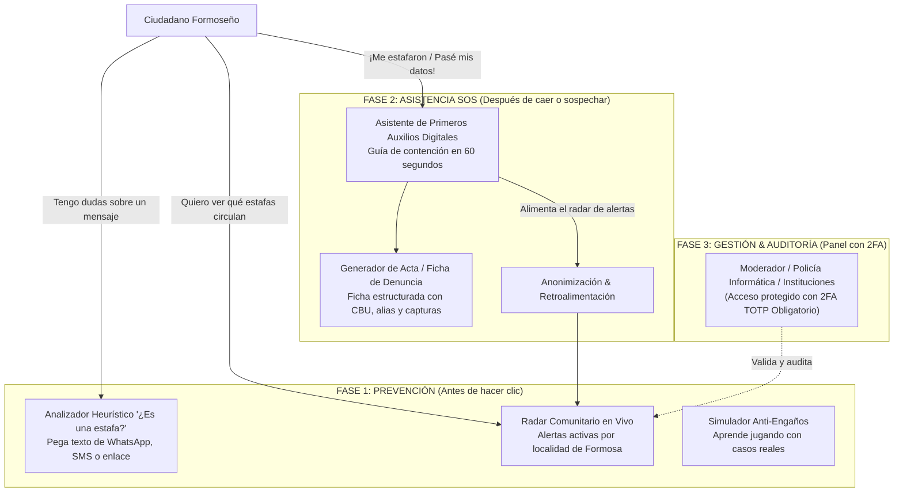

# Propuesta Integral de Solución — Gabriel Pineda
**FormosaHack 2026**  
**Eje Temático:** Seguridad  
**Desafío Asignado:** Dificultad para reconocer engaños y riesgos en entornos digitales (Fraude, Phishing, Suplantación de Identidad, Falsas Noticias y Estafas).

---

## 🛡️ Nombre del Proyecto: "CiberAlerta Formosa" (Escudo Comunitario & Prevención Digital)

### 💡 Concepto Central: El Ciclo Integral de Seguridad Ciudadana
La seguridad digital no se agota en advertir a la persona antes de hacer clic, ni en dejarla desamparada una vez que fue víctima. Esta propuesta unifica **Prevención Temprana** y **Asistencia Inmediata Post-Incidente** en una sola plataforma, donde **el incidente que un vecino sufrió hoy se convierte automáticamente en el escudo protector de toda la comunidad formoseña mañana.**

---

## 🧩 Módulos del Sistema Unificado

### 1. MÓDULO PREVENTIVO: "¿Tenés dudas? Analizá antes de hacer clic"
* **Analizador Heurístico "¿Es una Estafa?" (Instant Scanner):**
  * El usuario pega un mensaje de WhatsApp, SMS, correo o enlace web sospechoso (ej. *"Banco Formosa: Ingrese a este link para validar su token o se bloqueará la cuenta"* o avisos falsos de corte de REFSA).
  * El motor de análisis evalúa patrones críticos:
    * Urgencia psicológica extrema (*"en menos de 2 horas"*).
    * Solicitud de datos no compartibles (claves, tokens, transferencias).
    * Suplantación de identidad institucional (Banco Formosa, REFSA, ANSES, Ministerios).
    * Dominios falsos o sospechosos (`bancoformosa-redlink.xyz` vs dominio oficial).
  * **Salida Visual:** Semáforo de riesgo (🟢 Seguro / 🟡 Precaución / 🔴 Peligro), score de riesgo (0% a 100%), motivos en lenguaje sencillo y consejos de acción inmediata.

* **Radar de Alertas Comunitarias en Tiempo Real (Feed Provincial):**
  * Listado paginado de alertas activas geolocalizadas en Formosa (Capital, Clorinda, Pirané, El Colorado, Las Lomitas, etc.).
  * Filtros por localidad, categoría de fraude (Bancario, WhatsApp clonado, Servicios públicos, Compras falsas) y estado de verificación.
  * Botón *"A mí también me llegó"* que incrementa el nivel de alerta comunitario.

* **Simulador Anti-Engaños ("Aprende Jugando"):**
  * Desafío interactivo de 4 preguntas con capturas realistas para capacitar a jóvenes y adultos mayores a reconocer patrones de phishing.

---

### 2. MÓDULO POST-INCIDENTE: Botón Rojo "SOS: Me estafaron / Pasé mis datos"
* **Asistente de Primeros Auxilios Digitales (Triaje en 60 segundos):**
  * Diseñado para momentos de pánico, brinda contención y protocolos de acción en 3 pasos según el vector de ataque:
    * **Si pasó claves bancarias / token:** Botón de llamada directa a la línea de emergencia del Banco Formosa / Red Link para bloqueo preventivo inmediato de tarjetas y home banking.
    * **Si pasó el código de 6 dígitos de WhatsApp:** Pasos exactos para cerrar sesiones activas y enviar alerta a familiares antes de que pidan dinero a sus contactos.
    * **Si ya realizó una transferencia:** Instrucciones para recopilar el comprobante Coelsa, ID de transacción y solicitar la revocación bancaria.

* **Generador de Acta / Ficha de Denuncia Digital:**
  * Formulario estructurado para asentar:
    * CBU / CVU / Alias de destino del estafador.
    * Número de teléfono / WhatsApp del atacante.
    * Capturas de pantalla y relato cronológico.
  * Genera una ficha resumen en PDF/imprimible lista para ser radicada ante la Fiscalía o la Policía Informática provincial.

* **Efecto Multiplicador Solidario:**
  * El incidente se publica automáticamente de forma anónima en el Radar Comunitario, protegiendo a otros vecinos antes de que caigan en la misma modalidad.

---

### 3. PANEL DE GESTIÓN & AUDITORÍA (Microservicio de Autenticación con 2FA)
* Acceso restringido para moderadores comunitarios, personal institucional o policía informática.
* **Seguridad Estricta:** Inicio de sesión protegido con contraseña cifrada y **segundo factor de autenticación obligatorio (2FA TOTP con Google Authenticator / Authy)**.
* Funcionalidades:
  * Validación de alertas comunitarias (cambio de estado: Pendiente $\rightarrow$ Verificada / Oficial).
  * Soft Delete (`deleted_at`) de reportes inválidos o maliciosos.
  * Métricas y mapa de modalidades de estafas más frecuentes por departamento de la provincia.

---

## 🛠️ Encaje Técnico con Nuestro Stack Tecnológico

| Requerimiento Técnico de la Guía | Implementación en CiberAlerta Formosa |
| :--- | :--- |
| **Frontend React + Vite + Tailwind** | Interfaz responsiva con pestañas de fácil acceso (Prevención vs. Emergencia SOS), semáforo visual de colores y tipografías grandes y legibles. |
| **Cero Alertas Nativas (`alert()`)** | Notificaciones instantáneas con **Sonner Toasts** y modales accesibles (**ConfirmModal**) para confirmar denuncias o borrado de reportes. |
| **Repository Pattern en Backend** | Microservicio Core (`core_service`) separando `Router -> Service -> Repository -> Database` para las entidades de alertas, incidentes y análisis. |
| **Paginación y Filtros en Servidor** | El Radar Comunitario pagina por servidor (`page=1&limit=10`) con filtros dinámicos por `localidad`, `categoria` y `estado`. |
| **Soft Delete (`deleted_at`)** | Todas las tablas de base de datos implementan borrado lógico sin pérdida física de evidencia. |
| **2FA TOTP Obligatorio en Auth** | Microservicio `auth_service` con `pyotp` y códigos QR para el acceso administrativo y moderadores. |
| **Seeders de Formosa** | Datos de prueba verosímiles (`seed.py`) con casos contextualizados en Formosa Capital, Clorinda, REFSA, Banco Formosa y hospitales locales. |

---

## 👥 Reparto de Tareas Recomendado (Equipo de 4 Integrantes)

1. **Integrante 1 — Líder Frontend & UI/UX (Prevención & Scanner):**
   - Vistas del Analizador de Mensajes, Semáforo de Riesgo y el Radar de Alertas Comunitarias en tiempo real con Tailwind CSS.
2. **Integrante 2 — Frontend (Asistencia SOS, Denuncia & Simulador):**
   - Flujo del Botón de Emergencia SOS (triaje de 3 pasos), formulario de generación de ficha de denuncia y módulo del simulador interactivo.
3. **Integrante 3 — Líder Backend Core (Repository Pattern & Entidades):**
   - Modelos SQLAlchemy (`incident_reports`, `scans`), repositorios, servicios, endpoints REST con Pydantic v2, filtros y paginación en servidor.
4. **Integrante 4 — Backend Auth, Heurística & Seeders:**
   - Auth Service con 2FA TOTP, motor heurístico de puntuación de riesgo en FastAPI y seeder provincial con datos verosímiles de Formosa.

---

## 🎯 El Pitch Ganador ante el Jurado (3 Minutos)
> *"Los engaños digitales no se detienen únicamente advirtiendo a la gente que no haga clic: las personas a veces dudan y a veces caen en la trampa. CiberAlerta Formosa es la primera solución que acompaña al ciudadano en todo el ciclo: te da un escáner en el bolsillo para que salgas de dudas en 5 segundos, pero si lamentablemente ya caíste, no te deja solo; te da asistencia y contención inmediata en 60 segundos y convierte tu reporte en el escudo que salvará a miles de vecinos de nuestra provincia."*
