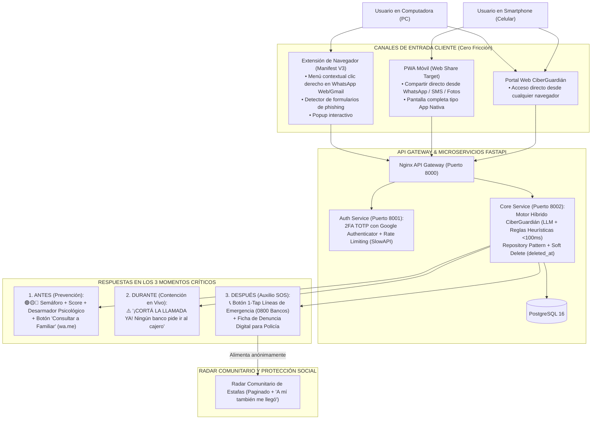

# Propuesta Maestra Definitiva — CiberGuardián
**FormosaHack 2026 — Ultra Hackatón de 24 Horas**  
**Eje Temático:** Seguridad y Sociedad  
**Desafío Asignado:** Dificultad para reconocer engaños y riesgos en entornos digitales (Fraude, Phishing, Suplantación de Identidad y Estafas).  
**Estado:** Documento Oficial Aprobado — Versión 1.0 Consolidada.

---

## 🎯 1. Tesis y Enfoque del Proyecto: "Chatbot-First & Ecosistema Multi-Canal"

> **"La ciberseguridad ciudadana no se resuelve con un antivirus técnico, porque los estafadores no atacan servidores: manipulan la mente de las personas. La clave está en brindar una asistencia conversacional inmediata, simple y al alcance de un clic, que acompañe al ciudadano antes de dudar, durante el pánico del intento y después de haber caído, integrándose de forma transparente en su computadora y en su teléfono celular."**

### La Estrategia de Dos Puntas para Cero Fricción:
Nadie quiere copiar y pegar manualmente si puede resolverlo con un toque. La solución se adapta orgánicamente al dispositivo del usuario:

1. **En la PC (Extensión de Navegador Manifest V3):**
   - Centinela en segundo plano que protege la navegación cotidiana:
     * **Menú contextual:** Clic derecho sobre cualquier texto o enlace en **WhatsApp Web**, **Gmail** o páginas web $\rightarrow$ *"Analizar con CiberGuardián"*.
     * **Alerta de Formularios Sospechosos:** Detecta en tiempo real páginas que solicitan claves bancarias, tokens o números de tarjeta en dominios no oficiales antes de escribir los datos.
     * **Popup Completo:** Acceso al asistente conversacional completo en una ventana lateral siempre a mano.

2. **En el Celular (PWA + Función Nativa "Compartir..."):**
   - Sin necesidad de descargas pesadas de tiendas ni fricciones:
     * Utiliza la API web estándar **Web Share Target** al agregarse a la pantalla de inicio.
     * Cuando el usuario recibe un mensaje sospechoso en **WhatsApp móvil**, SMS o correo: **mantener presionado $\rightarrow$ Compartir $\rightarrow$ CiberGuardián**.
     * Se abre automáticamente el asistente con el texto o enlace ya precargado y el diagnóstico en pantalla en 3 segundos.
     * **Privacidad Absoluta:** No espía los chats del usuario; es la persona quien decide conscientemente qué contenido enviar a analizar.

---

## 🏗️ 2. Arquitectura General del Sistema

---

## ⚡ 3. El Funcionamiento en los 3 Momentos Críticos de la Estafa

### Momento 1: PREVENCIÓN — "¿Tenés dudas? Desarmá la trampa antes de hacer clic"
* **Cómo se activa:**
  - En PC: Clic derecho sobre el enlace o texto en WhatsApp Web / Gmail $\rightarrow$ *"Analizar con CiberGuardián"*.
  - En Celular: Botón nativo "Compartir" de WhatsApp hacia CiberGuardián, o pegando en el chat web.
* **Diagnóstico Inmediato (<100ms):**
  1. **Semáforo Visual y Score de Riesgo:** Indicador intuitivo (🟢 Seguro / 🟡 Precaución / 🔴 Peligro) con porcentaje de riesgo (0% a 100%).
  2. **Desarmador de Manipulación Psicológica:** Explica la trampa mental detrás del mensaje:
     - *Urgencia artificial:* "Te dicen que tu cuenta se bloquea en 2 horas para que no te tomes tiempo de pensar".
     - *Falsa autoridad:* "Se hacen pasar por una entidad financiera, pero el enlace no pertenece al dominio oficial registrado".
  3. **Botón "Consultar a mi persona de confianza":** Abre WhatsApp con el análisis redactado y listo para reenviar a un familiar o tutor digital sin requerir registros.

---

### Momento 2: CONTENCIÓN — "Me están llamando o apurando ahora mismo"
* **Cómo se activa:** El usuario atiende una llamada sospechosa o está siendo presionado en tiempo real y pulsa el botón destacado: *"⚡ Me están llamando o apurando ahora mismo"*.
* **Intervención Instantánea de Ruptura de Pánico:**
  1. Mensaje visual de impacto inmediato en color rojo:
     > **"¡CORTÁ LA LLAMADA AHORA MISMO! Ninguna entidad bancaria, empresa de servicios ni organismo público te va a pedir tu clave token, tu contraseña ni te hará ir a un cajero automático."**
  2. Guía rápida de 3 preguntas de verificación si insisten:
     - *"¿Te dicen que ganaste un sorteo o subsidio pero tenés que pagar un gasto previo?"* $\rightarrow$ **ES UNA ESTAFA.**
     - *"¿Te piden el código de 6 dígitos que te acaba de llegar por SMS?"* $\rightarrow$ **TE ESTÁN ROBANDO EL WHATSAPP.**
     - *"¿Te dicen que un familiar tuvo un accidente grave y necesita plata ya?"* $\rightarrow$ **Cortá y llamá a tu familiar al número que ya tenías agendado.**

---

### Momento 3: AUXILIO RÁPIDO POST-INCIDENTE — "¡Ya pasé mis datos o plata, auxilio!" (SOS)
* **Cómo se activa:** La persona cometió el error, transfirió dinero o entregó sus claves y pulsa *"🚨 ¡Pasé mis datos o plata, auxilio!"*.
* **Protocolo de Primeros Auxilios Digitales en 60 Segundos:**
  1. **Botón de Llamada Directa (1-Tap):** Accesos telefónicos directos con un solo toque a las líneas de contingencia 24hs oficiales:
     - **Red Link:** `0800-888-5465` (Bloqueo de Home Banking y tarjetas de débito).
     - **Banelco:** `011-4320-5000` (Bloqueo de tarjetas y claves).
     - **Banco Formosa:** `0800-777-7772` / Red de atención inmediata.
  2. **Generador de Ficha de Denuncia Digital:**
     - El bot recopila los 3 datos esenciales del hecho: CBU/Alias o billetera de destino, teléfono del atacante y breve cronología.
     - Genera una **Ficha de Denuncia Estructurada** descargable/imprimible con fecha, hora y evidencia preservada, lista para la Policía Informática o Fiscalía.
  3. **Inmunidad Colectiva:** De forma 100% anónima, el modus operandi alimenta el Radar Comunitario para advertir a la población.

---

## 🌐 4. Radar Comunitario de Estafas Activas & Alertas de WhatsApp

Al ser estafas digitales, el radar se organiza por **modalidades y entidades suplantadas**, no por límites geográficos:
1. **Catálogo de Amenazas en Tiempo Real:**
   - Feed público de estafas detectadas, clasificado por Entidad Suplantada y Vector de Ataque (WhatsApp, SMS, Llamada, Correo).
2. **Botón "A mí también me llegó":**
   - Contador de incidencia colectiva. Cuando una modalidad acumula reportes, el sistema eleva la alerta a **Riesgo Crítico / Brote Activo**.
3. **Generador de Alertas Gráficas para WhatsApp:**
   - Exporta cualquier alerta como una tarjeta visual (*"⚠️ ALERTA: Falso mensaje de banco circulando por WhatsApp"*), permitiendo que la prevención viaje en grupos familiares y vecinales.

---

## ♿ 5. Inclusión Universal: "Modo Protector Mayor"
* **Tipografías Extra Grandes:** Legibilidad óptima sin esfuerzo visual.
* **Lenguaje Claro y Coloquial:** Cero tecnicismos en inglés (*phishing*, *malware*); términos directos: *"sitio falso"*, *"trampa mental"*, *"robo de cuenta"*.
* **Contraste Accesible:** Botones de gran tamaño y paleta visual intuitiva.

---

## 🛠️ 6. Cumplimiento Estricto de la Guía Técnica del IPF

| Exigencia de la Guía del Profesor | Cómo lo Implementa CiberGuardián |
| :--- | :--- |
| **Cero Alertas Nativas (`alert()`)** | 100% notificaciones con **Sonner Toasts** y modales accesibles (**ConfirmModal**). |
| **Arquitectura de Microservicios con Gateway** | Nginx Reverse Proxy (puerto 8000) orquestando `auth_service` (8001), `core_service` (8002) y `frontend` (5173/80). |
| **Repository Pattern en Backend** | Separación en Core Service: `Router -> Service -> Repository -> Database`. |
| **Paginación y Filtros en Servidor** | El Radar Comunitario pagina en servidor (`page`, `limit`) sin traer listas completas a memoria. |
| **Borrado Lógico (Soft Delete)** | Todas las entidades de PostgreSQL implementan la columna `deleted_at`. |
| **Seguridad 2FA TOTP con PyOTP** | Obligatorio en el microservicio de Auth para moderadores con validación de códigos de 6 dígitos. |

---

## 🎤 7. Guion de Demostración en Vivo ante el Jurado (3 Minutos)

* **Minuto 0:00 - 0:45 (El Problema y la Simplicidad):**
  *"Buenas tardes. En ciberestafas, el problema no es que falte tecnología; el problema es que cuando a una persona le llega un mensaje de urgencia o la llaman apurada, entra en pánico y no tiene a quién acudir. Por eso creamos **CiberGuardián**, un asistente conversacional inmediato que no requiere registro ni conocimientos técnicos y vive donde la gente se comunica: en la PC con extensión de navegador y en el celular mediante la función nativa de compartir."*
* **Minuto 0:45 - 1:30 (Demostración de Prevención en PC y Celular):**
  *En la notebook:* Clic derecho en WhatsApp Web sobre un mensaje sospechoso $\rightarrow$ el popup de CiberGuardián resalta en rojo la urgencia artificial y en amarillo el enlace trucho, explicando la trampa mental.  
  *En el celular:* Mostramos la función nativa *"Compartir mensaje con CiberGuardián"* abriendo el diagnóstico al instante.
* **Minuto 1:30 - 2:15 (El Diferencial SOS Post-Incidente):**
  *"¿Pero qué pasa si la persona dudó tarde y ya transfirió plata o dio sus claves? CiberGuardián activa el Botón SOS: con un solo toque llama a la línea de bloqueo de emergencias bancarias y le genera en el acto la Ficha de Denuncia para la Policía Informática con el CBU del atacante."*
* **Minuto 2:15 - 3:00 (Inmunidad Colectiva y Seguridad 2FA):**
  *"Ese reporte alimenta el Radar Comunitario en tiempo real y genera una tarjeta gráfica lista para reenviar a grupos de WhatsApp. Mostramos cómo los moderadores acceden al panel con autenticación de dos factores (2FA TOTP con Google Authenticator), garantizando el cumplimiento al 100% de la arquitectura solicitada."*
