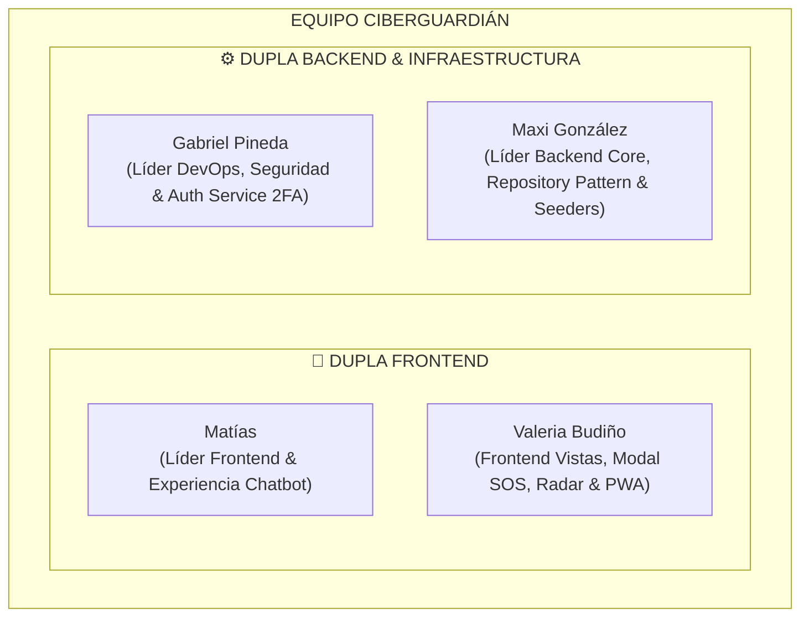

# Asignación Oficial de Roles y Duplas Fullstack — CiberGuardián
**FormosaHack 2026 — Ultra Hackatón de 24 Horas**  
**Configuración Oficial:** Duplas de Desarrollo  
**Estado:** Confirmado y Aprobado por el Equipo (Rama `design`)

---

## 👥 1. Estructura del Equipo en Duplas



---

## 🎨 2. Dupla Frontend: Matías + Valeria Budiño

### A. Matías — Líder Frontend & Experiencia Conversacional (Chatbot)
* **Responsabilidades Clave:**
  - Pantalla principal interactiva en **React 19 + TypeScript + Tailwind CSS**.
  - Burbujas de diálogo fluidas del Chatbot y selector de los 3 chips de emergencia al entrar (Prevención, Durante llamada, Post-incidente).
  - Componente de renderizado de diagnósticos: **Semáforo visual de riesgo**, score (0-100%) y el **resaltado interactivo de frases engañosas en el texto**.
  - Botón directo de consulta a un familiar por WhatsApp (`wa.me`).
  - Integración del cliente Axios (`api.ts`) con el endpoint del chatbot, manejo de Sonner Toasts (cero `alert()`) y animaciones de escritura (*typing indicator*).
* **Directorio principal de trabajo:** `frontend/src/components/chat/` y `frontend/src/App.tsx`.

### B. Valeria Budiño — Frontend Vistas Complementarias, SOS, Radar & PWA
* **Responsabilidades Clave:**
  - Componente del **Botón de Pánico SOS**: accesos telefónicos directos con 1 toque (`tel:...`) a las líneas oficiales 24hs de emergencia bancaria (Banco Formosa, Red Link, Banelco).
  - Formulario y generación visual de la **Ficha de Denuncia Digital estructurada** (lista para imprimir/descargar para la Policía Informática).
  - Vista del **Radar de Amenazas**: Listado paginado de incidentes con filtros de búsqueda por entidad y vector, banner de alerta de brotes y botón *"A mí también me llegó"*.
  - Switch de accesibilidad (**Modo Protector Mayor** con tipografías XL) y configuración PWA móvil (`Web Share Target`).
* **Directorio principal de trabajo:** `frontend/src/components/sos/`, `frontend/src/components/radar/` y `frontend/public/manifest.webmanifest`.

---

## ⚙️ 3. Dupla Backend & Infraestructura: Gabriel Pineda + Maxi González

### A. Gabriel Pineda — Líder de DevOps, Seguridad & Auth Service
* **Responsabilidades Clave:**
  - Orquestación de infraestructura: Docker Compose, Blueprint de Render.com y GitHub Actions Self-Hosted Runner en máquina virtual Ubuntu Server.
  - Microservicio de Autenticación (`auth_service`): Gestión de JWT, contraseñas seguras con bcrypt, Rate Limiting (SlowAPI) y **segundo factor de autenticación obligatorio (2FA TOTP con Google Authenticator / PyOTP)**.
  - Seguridad perimetral: Cabeceras HTTP contra clickjacking/XSS en el API Gateway (Nginx) y configuración estricta de CORS.
  - Pruebas unitarias de seguridad y pipeline de testing con `pytest`.
* **Directorio principal de trabajo:** `.github/workflows/`, `backend/gateway/`, `backend/auth_service/` y `tests/`.

### B. Maxi González — Líder Backend Core, Repository Pattern & Seeders
* **Responsabilidades Clave:**
  - Microservicio Core (`core_service`): Modelos SQLAlchemy `incident_reports`, `incident_votes`, `official_channels` con la columna obligatoria de borrado lógico **`deleted_at`** (Soft Delete).
  - Arquitectura estricta de la guía: **Repository Pattern** (`IncidentRouter -> IncidentService -> IncidentRepository -> PostgreSQL`).
  - Endpoints REST del Radar de Amenazas (`GET /api/core/incidents` paginado en servidor con `page` y `limit`), filtros por entidad/vector y lógica de detección de brotes de ataques activos (*Spikes / Outbreak Alerts*).
  - Endpoint de registro de denuncias SOS (`POST /api/core/incidents`), votación colectiva (`POST /me-too`) y script de seeders con datos reales (`seed.py`).
* **Directorio principal de trabajo:** `backend/core_service/app/models/`, `repositories/`, `services/`, `routers/` y `scripts/seed.py`.

---

## 🤝 4. Reglas de Convivencia en Git para no Pisarse en `develop`

1. **Cada dupla y miembro tiene su propio directorio asignado**, evitando modificar los mismos archivos simultáneamente.
2. **Commits atómicos y descriptivos en español:**
   - Ejemplos: `feat(front): crear componente de burbujas del chatbot`, `feat(core): implementar repository pattern para incidentes`.
3. **Pull frecuente:** Antes de empezar a codear o hacer push, ejecutar siempre:
   ```bash
   git pull origin develop
   ```
