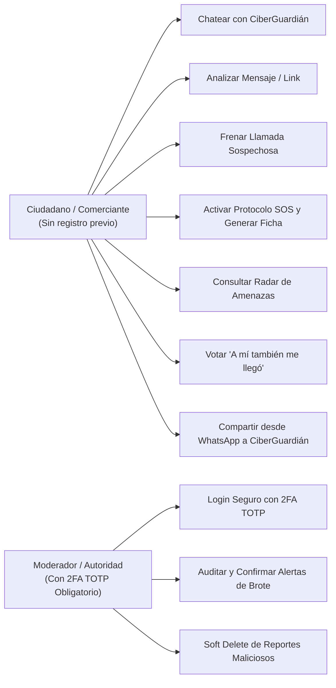
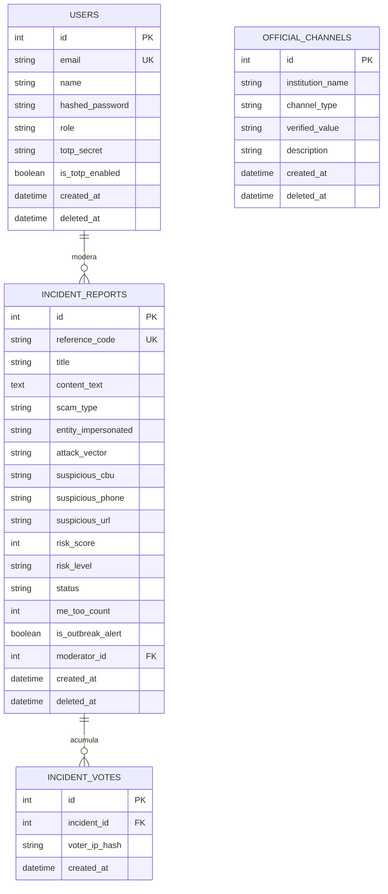

# Documento de Especificación del Sistema (SDD) — CiberGuardián
**FormosaHack 2026 — Ultra Hackatón de 24 Horas**

> **Metodología:** Spec-Driven Development (SDD) con Asistencia de Inteligencia Artificial.  
> **Estado:** Borrador Formal para Revisión y Aprobación del Equipo (Rama `design`).  
> **Eje Temático:** Seguridad y Sociedad.  
> **Proyecto:** CiberGuardián — Asistente Ciudadano de Auxilio Rápido, Prevención y Detección de Brotes ante Estafas Digitales.

---

## 1. Descripción del Problema y Contexto Técnico

### 1.1 Naturaleza Ubicua del Ciberdelito
En el entorno digital, **las estafas no reconocen fronteras geográficas, límites barriales ni zonas físicas**. Un ciberdelincuente puede operar desde cualquier punto remoto y lanzar campañas masivas simultáneas que impactan en teléfonos de cualquier rincón del país. Lo que caracteriza y define a una amenaza digital es:
1. **La Entidad Suplantada:** Instituciones bancarias, billeteras virtuales (Mercado Pago, Modo), empresas de servicios públicos (electricidad, telefonía), redes sociales o plataformas de comercio electrónico.
2. **El Vector Digital de Ataque:** Mensajería instantánea (WhatsApp, Telegram), mensajes de texto (SMS), llamadas telefónicas con engaño en vivo o enlaces a sitios web clonados.

### 1.2 La Brecha Crítica en la Seguridad Ciudadana
El problema central no radica en la ausencia de antivirus en los servidores, sino en que **a las personas les cuesta reconocer el engaño a tiempo debido a la manipulación psicológica (urgencia artificial, miedo a la pérdida o suplantación de autoridad).**
- **Antes:** Cuando la persona duda, no tiene una vía de consulta rápida y anónima en menos de 5 segundos.
- **Durante:** Si está atendiendo una llamada de presión en vivo, entra en pánico y no cuenta con una herramienta que corte el secuestro emocional.
- **Después:** Si ya entregó sus claves o transfirió dinero, queda en total desamparo en los primeros 15 minutos críticos sin saber a qué líneas de contingencia 24hs llamar ni cómo estructurar la evidencia para radicar la denuncia.

---

## 2. Objetivos del Sistema

### 2.1 Objetivo General
Desarrollar un prototipo funcional (MVP) de alta calidad en 24 horas centrado en **CiberGuardián**: un asistente conversacional híbrido de auxilio rápido que no requiere registro ni conocimientos previos, protegiendo al ciudadano en los 3 tiempos de la estafa (**Prevención, Contención en Llamada y Auxilio SOS Post-Incidente**), complementado con una extensión de navegador en PC, función nativa de compartir en celular y un Radar de Amenazas que detecta **brotes masivos de ataques del mismo tipo**.

### 2.2 Objetivos Específicos
1. **Asistencia Rápida Conversacional:** Proveer un Chatbot interactivo con chips de acción directa y entrada libre para pegar textos, SMS o enlaces sospechosos.
2. **Diagnóstico Estructurado con Desarmador Psicológico:** Motor híbrido (IA Generativa + reglas heurísticas locales <100ms) que devuelve semáforo, score de riesgo y explica la trampa mental detrás del mensaje.
3. **Protocolo SOS y Líneas de Emergencia:** Botones directos de llamada (1-Tap) a líneas oficiales 24hs de bancos y redes de pago, más generador de la Ficha de Denuncia Digital estructurada para la Policía Informática.
4. **Detección de Brotes y Radar de Amenazas:** Radar categorizado por entidad suplantada y vector de ataque, con notificaciones de alerta temprana cuando se acumulan incidentes de una misma modalidad.
5. **Ecosistema Multi-Canal sin Fricción:**
   - En PC: Extensión de navegador (Manifest V3) con menú contextual (clic derecho) en WhatsApp Web, Gmail y páginas web, más detector de formularios de phishing.
   - En Celular: Integración PWA con la API nativa `Web Share Target` (compartir mensajes desde WhatsApp directo al bot).
6. **Cumplimiento Estricto de la Guía del Profesor:** Microservicios en FastAPI con API Gateway Nginx, PostgreSQL 16 con Repository Pattern, Soft Delete (`deleted_at`), paginación en servidor y seguridad con **2FA TOTP obligatorio (Google Authenticator)** para moderadores.

---

## 3. Alcance del MVP (Ventana de 24 Horas)

### 3.1 Dentro del Alcance (Core MVP)
* **Chatbot CiberGuardián (Pantalla Principal):**
  - 3 Botones rápidos de entrada:
    1. 🛡️ *"Analizar mensaje o enlace sospechoso"* (Prevención).
    2. ⚡ *"Me están llamando o apurando ahora mismo"* (Contención durante la llamada).
    3. 🚨 *"¡Pasé mis datos o plata, auxilio!"* (Auxilio rápido SOS).
  - Caja de texto para pegar mensajes de WhatsApp o enlaces.
  - Diagnóstico visual: Semáforo (Verde/Amarillo/Rojo), score (0-100%) y desglose de frases sospechosas.
  - Botón *"Consultar a un familiar por WhatsApp"* (`wa.me`).
  - Accesos telefónicos 1-Tap a líneas oficiales de emergencia bancaria.
  - Generador descargable/imprimible de Ficha de Denuncia Digital con código de referencia.
* **Extensión de Navegador (PC - Manifest V3):**
  - Menú contextual: Clic derecho sobre texto o link en WhatsApp Web / Gmail $\rightarrow$ *"Analizar con CiberGuardián"*.
  - Alerta en formularios web que solicitan claves/tokens en dominios no oficiales.
* **PWA Móvil (Web Share Target):**
  - Registro de la app en el menú nativo "Compartir..." de Android/iOS para enviar mensajes de WhatsApp directo al bot.
* **Radar de Amenazas & Notificaciones de Brote:**
  - Listado paginado de incidentes clasificados por entidad y vector con botón *"A mí también me llegó"*.
  - Notificación de alerta destacada cuando una modalidad presenta un pico inusual de reportes (brote activo).
* **Panel de Auditoría & Moderación (Acceso Institucional):**
  - Autenticación segura con JWT y **2FA TOTP obligatorio con Google Authenticator**.
  - Soft Delete (`deleted_at`) de reportes inválidos y confirmación oficial de alertas.

### 3.2 Fuera del Alcance (Fase Futura)
- Integración oficial con APIs privadas de Home Banking.
- Rastreo en tiempo real de transacciones en la red interbancaria.

---

## 4. Requisitos Funcionales (RF) y No Funcionales (RNF)

### 4.1 Requisitos Funcionales (RF)
- **RF-01 (Chatbot Conversacional Híbrido):** El sistema debe permitir a cualquier ciudadano interactuar mediante chips de acción rápida o texto libre sin requerir registro de cuenta.
- **RF-02 (Diagnóstico Heurístico & Desarme Psicológico):** El backend debe evaluar urgencia artificial, solicitudes de claves/tokens y dominios falsos, devolviendo semáforo de riesgo, score (0-100%) y frases resaltadas con su justificación.
- **RF-03 (Protocolo de Contención para Llamadas):** El bot debe proveer un mensaje de descompresión de emergencia instantáneo para interrumpir llamadas fraudulentas en curso (*"¡CORTÁ LA LLAMADA YA!"*).
- **RF-04 (Protocolo SOS y Líneas de Emergencia):** El bot debe proveer enlaces telefónicos directos (`tel:...`) a las líneas 24hs oficiales de bloqueo de tarjetas y home banking.
- **RF-05 (Generación de Ficha de Denuncia):** El sistema debe recopilar datos del estafador (CBU/Alias, teléfono, relato) y generar una ficha descargable/imprimible con código único de referencia.
- **RF-06 (Radar de Amenazas Paginado en Servidor):** Listado público de incidentes paginados (`page`, `limit`) con filtros por entidad suplantada y vector de ataque.
- **RF-07 (Detección de Brotes y Voto 'A mí también me llegó'):** Los usuarios pueden confirmar que recibieron la misma modalidad. Cuando una entidad o vector acumula múltiples reportes recientes, el sistema activa una notificación de alerta de brote activo.
- **RF-08 (Extensión de Navegador en PC):** La extensión debe permitir enviar texto o enlaces seleccionados al asistente mediante menú contextual y alertar ante formularios sospechosos.
- **RF-09 (Compartir Nativo en Móvil):** La PWA debe aceptar texto y URLs compartidas desde aplicaciones externas mediante `Web Share Target API`.
- **RF-10 (Autenticación con 2FA TOTP):** Los moderadores deben autenticarse mediante contraseña hasheada y código temporal de 6 dígitos de Google Authenticator.
- **RF-11 (Soft Delete Obligatorio):** Todas las entidades de incidentes y usuarios deben implementar borrado lógico con `deleted_at`.

### 4.2 Requisitos No Funcionales (RNF)
- **RNF-01 (Cero Alertas Nativas):** Prohibido el uso de `alert()` en React. Utilizar Sonner Toasts y modales accesibles para confirmaciones destructivas.
- **RNF-02 (Arquitectura en Capas):** El backend debe estructurarse estrictamente bajo `Router -> Service -> Repository -> Database`.
- **RNF-03 (Rendimiento & Disponibilidad):** Tiempos de respuesta del bot < 100ms en modo local; connection pooling activo en PostgreSQL.
- **RNF-04 (Seguridad Estricta):** Rate limiting con SlowAPI en endpoints sensibles, contraseñas con bcrypt, cabeceras contra clickjacking y CORS restrictivo.

---

## 5. Actores y Casos de Uso



---

## 6. Modelo de Datos (PostgreSQL 16)



---

## 7. Contratos de la API REST (End-to-End)

### 7.1 Chatbot: `POST /api/core/chat/message`
* **Request:**
```json
{
  "message": "Banco Formosa: Ingrese a este link https://banco-redlink.xyz para validar su token o su cuenta será suspendida en 2 horas.",
  "context": "PREVENCION"
}
```
* **Response (HTTP 200 OK):**
```json
{
  "reply": "⚠️ Este mensaje es un intento de estafa de alto riesgo. Ninguna entidad bancaria te solicitará validar claves por mensaje ni te amenazará con bloqueos inmediatos.",
  "risk_assessment": {
    "level": "PELIGRO_ALTO",
    "score": 95,
    "manipulation_type": "URGENCIA_Y_SUPLANTACION_BANCARIA",
    "highlighted_phrases": [
      {
        "phrase": "será suspendida en 2 horas",
        "reason": "Urgencia artificial para forzar una decisión por impulso.",
        "severity": "ALTO"
      },
      {
        "phrase": "https://banco-redlink.xyz",
        "reason": "Dominio fraudulento que suplanta la identidad oficial.",
        "severity": "ALTO"
      }
    ]
  },
  "suggested_chips": [
    {"label": "Consultar con un familiar", "action": "SHARE_WHATSAPP"},
    {"label": "Generar Ficha de Denuncia", "action": "START_DENUNCIA"}
  ],
  "emergency_contacts": [
    {"name": "Línea Emergencia Banco Formosa", "phone": "08007772262"},
    {"name": "Red Link Bloqueo 24hs", "phone": "08008885465"}
  ]
}
```

---

### 7.2 Radar de Amenazas: `GET /api/core/incidents`
* **Query Params:** `page=1&limit=10&entidad=Banco%20Formosa&vector=SMS&tipo=PHISHING&search=token`
* **Response (HTTP 200 OK):**
```json
{
  "data": [
    {
      "id": 15,
      "reference_code": "DEN-2026-A8F2",
      "title": "Falsa actualización de clave token bancario",
      "scam_type": "PHISHING_BANCARIO",
      "entity_impersonated": "Banco Formosa",
      "attack_vector": "SMS",
      "risk_level": "PELIGRO_ALTO",
      "status": "VERIFICADO",
      "me_too_count": 8,
      "is_outbreak_alert": true,
      "created_at": "2026-09-24T15:30:00Z"
    }
  ],
  "page": 1,
  "limit": 10,
  "total": 1,
  "total_pages": 1,
  "active_outbreaks": [
    {
      "entity": "Banco Formosa",
      "type": "PHISHING_BANCARIO",
      "recent_reports": 8,
      "alert_message": "⚠️ Campaña activa de mensajes falsos solicitando claves token de Banco Formosa."
    }
  ]
}
```

---

### 7.3 Registro de Denuncia SOS: `POST /api/core/incidents`
* **Request:**
```json
{
  "title": "Transferencia a cuenta desconocida por engaño en WhatsApp",
  "description": "Me contactaron haciéndose pasar por un familiar pidiendo una transferencia urgente.",
  "scam_type": "SUPLANTACION_WHATSAPP",
  "entity_impersonated": "Familiar / WhatsApp",
  "attack_vector": "WHATSAPP",
  "suspicious_cbu": "0000003100012345678901",
  "suspicious_phone": "+5493704998877",
  "suspicious_url": null,
  "risk_score": 90
}
```
* **Response (HTTP 201 Created):**
```json
{
  "id": 16,
  "reference_code": "DEN-2026-B3C9",
  "status": "PENDIENTE",
  "created_at": "2026-09-24T15:55:00Z",
  "message": "Ficha de denuncia registrada exitosamente. Lista para imprimir o presentar ante la Policía Informática."
}
```

---

### 7.4 Voto de Alerta Colectiva: `POST /api/core/incidents/{id}/me-too`
* **Response (HTTP 200 OK):**
```json
{
  "incident_id": 16,
  "new_me_too_count": 9,
  "is_outbreak_alert": true,
  "message": "Incidencia colectiva registrada. Ayudaste a elevar la alerta para proteger a la comunidad."
}
```

---

## 8. Arquitectura de Seguridad (Cumplimiento de Guía del Profesor)

1. **Segundo Factor 2FA TOTP Obligatorio:** Microservicio `auth_service` con `pyotp`, emisión de secreto y QR en Base64 para el inicio de sesión de moderadores y autoridades.
2. **Rate Limiting Estricto:** Límites de solicitudes por IP con SlowAPI en endpoints sensibles (`/login`, `/register`, `/chat/message`).
3. **Repository Pattern:** Microservicio Core desacoplado en capas independientes: `IncidentRouter -> IncidentService -> IncidentRepository -> PostgreSQL`.
4. **Soft Delete (`deleted_at`):** Ningún incidente ni usuario se elimina físicamente; se conserva la evidencia digital íntegra para fines periciales y de auditoría.
5. **Cero Alertas Nativas (`alert()`):** La interfaz de React utiliza exclusivamente Sonner Toasts (`toast.success()`, `toast.error()`) y componentes Modales accesibles (`ConfirmModal`).
